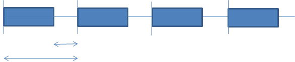

# Интервалы и задержки

**Задержки**

**setTimeout** – вызывает функцию через заданное количество миллисекунд

Следующий пример использует анонимную функцию

```js
setTimeout(function(){ alert("Hello"); },3000);
```

Но мы можем передать в setTimeout просто название функции.   
Код снизу через три секунды после запуска выведет в консоль 12.

```js
function func_sum(a,b) {
    console.log(a+b);
}

setTimeout(func_sum,3000,5,7);
```

А этот код через две секунды выведет 'Hello World!'

```js
setTimeout('console.log("Hello World!");',2000);
```

**Интервалы**

Если мы хотим, чтобы код функции запускался регулярно воспользуемся функцией **setInterval**

Общее ее описание представлено ниже. Как и в случае с setTimeout параметры после задержки необязательны\(указаны в квадратных скобках\).

```js
var intervalID = setInterval(func, delay[, param1, param2, ...]);
var intervalID = setInterval(code, delay);
```

Следующий код будет выводить 'Beep, beep' каждую секунду

```js
function sputnik() {
    console.log('Beep, beep');
}

setInterval(sputnik,1000);
```

**Прерывание вызова по таймеру**

setInterval, как и setTimeout возвращает id, по которому можно прервать отложенное выполнение. clearInterval позволяет отменить setInterval, clearTimeout может отменить setTimeout.

Общий вид этих функций таков

```js
clearInterval(IntervalId)

clearTimeout(TimerId)
```

Давайте рассмотрим пример, который останавливает вызов "по интервалу" при нажатии на кнопку.

```html
<button onclick="stopBeeping();">
Отправить в океан
</button>

<script>
function sputnik() {
    console.log('Beep, beep');
}

var timerId = setInterval(sputnik,1000);

function stopBeeping() {
    clearInterval(timerId);
};
</script>
```

**Очередь и наложение вызовов в setInterval**



Поскольку на выполнение кода требуется время, то в реальности время между вызовами функции будет меньше чем указано в setInterval  
Если же функции будут выполняться дольше чем идут вызовы, то вызовы будут накапливаться в очередь

**Рекурсивный вызов setTimeout**

Для того, чтобы обеспечить гарантированное время между вызовами функции, используется следующая техника

```js
var i=1;
var timer = setTimeout(function run() {
    console.log(i++);
    timer = setTimeout(run,2000);
    },2000
)
```

По переменной timer мы можем прервать весь этот процесс.

**Debouncing**

Есть input.После того как мы перестали активно набирать, должен срабатывать alert.  
Техника состоит в том, что обработчик мы помещаем в таймер. При повторном вызове обработчика, таймер удаляется.

```js
function debounce() {
    clearTimeout(timerId); //удаляем старый таймер, так как сгенерировалось //новое событие
    timerId = setTimeout(fn_action,2000);
}
```

**Практика:**

1. Сделать блок, который мигает

2. Сделать блок, который начинает мигать при нажатии на клавишу

3. Добавить к предыдущему заданию кнопку stop, которая бы оставливала мигание

4. Нажимаем кнопку start несколько раз - проверяем работоспособность

5. "Бегущий элемент" - есть четыре блока. По очереди вспыхивает, то первый, то второй, то третий, то четвертый, потом опять первый.

6. Делаем таймер обратного отсчета

7. Сделать автообновляющиеся часы. Использовать объект Date

8. Сделать слайдер. Переключение слайдера происходит автоматически, или по клику пользователя

9. "Тренировка быстрой печати". Пользователю показываются клавиши на экране, и он должен успеть их нажать, пока они не погасли. При каждом успешном нажатии пользователю начисляется бал.


